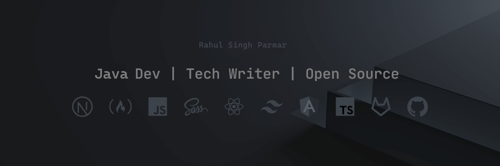

<!-- Banner Image -->

<!-- About Me -->
## About Me

  
  

[//]: # (  <a href="https://codepen.io/rahulsinghparmar"> )

[//]: # (    )

[//]: # (  </a>)

Hello human,  

My name is Rahul Singh Parmar. I'm a FullStack developer who loves building ideas and projects. I place a deep interest and actively contribute to the open source ecosystem.

As a highly sociable and energetic person, feel free to DM or ask me any question anywhere I exist on the internet. Just don't say "Hi", only. :)

[//]: # ()
[//]: # (## Achievements)

[//]: # ()
[//]: # (<table>)

[//]: # (<!-- First row -->)

[//]: # (<tr>)

[//]: # (<td align="center"></td>)

[//]: # (<td align="center"></td>)

[//]: # (<td align="center"></td>)

[//]: # (<td align="center"></td>)

[//]: # (<td align="center"></td>)

[//]: # (<td align="center"></td>)

[//]: # (<td align="center"></td>)

[//]: # (<td align="center"></td>)

[//]: # (<td align="center"></td></a>)

[//]: # (<td align="center"></td></a>)

[//]: # (<td align="center"></td></a>)

[//]: # (</tr>)

[//]: # ()
[//]: # (<!-- Second row -->)

[//]: # (<tr>)

[//]: # (<td align="center"></td></a>)

[//]: # (</tr>)

[//]: # (</table>)

[//]: # ()
[//]: # (<!-- Open source -->)

[//]: # (## Open Source)

[//]: # (<a href="https://github.com/CommunityPro" align="left">)

[//]: # ()

[//]: # ()

[//]: # (</a>)

[//]: # ()
[//]: # (- Building [communitypro]&#40;https://github.com/CommunityPro&#41;, an awesome community of over 200+ developers on GitHub)

[//]: # (- Contributing to [vitejs]&#40;https://github.com/vitejs/&#41; docs.)

[//]: # (- Maintaining [Portfolio Ideas]&#40;https://github.com/evavic44/portfolio-ideas&#41;  )

[//]: # ()
[//]: # (<!-- Work -->)

[//]: # (## Work)

[//]: # (I love working on creative ideas, transforming UI to code, and maintainig projects on GitHub. Have any opportunities for me, kindly send me an email.)

[//]: # ()
[//]: # (- Previosuly working with <a href="https://aviyel.com/@victoreke">Aviyel</a> growth, design & product teams to help bridge the gap with open source content around some of the fastest growing projects.)

[//]: # (- Freelance projects and contracts.)

<!-- Featured Projects -->
## Featured Projects
As a huge fan of open source, all my personal projects live on GitHub. I have built over 10+ projects but there are some that I believe are worth mentioning:

  <!--  Java Core   -->
  
  <!--  Resume   -->
  
  <!--  my first blog   -->
  
  <!--  Custom PC Build    -->
  

<!-- Blog Action Workflow -->
## Blogs posts

<!-- BLOG-POST-LIST:START -->
<!-- BLOG-POST-LIST:END -->

## Recent GitHub Activity
<!--START_SECTION:activity-->
<!--END_SECTION:activity-->

### Spotify Playing 🎧

&nbsp;

<h3 align="left">Connect with me:</h3>

<h3 align="left">Languages and Tools:</h3>

                                       

### GITHUB STATS

  

    
    
   
 

    <i><b>Note:</b> Top languages is only a metric of the languages my public code consists of and doesn't reflect experience or skill level.</i>
  

<!-- GitHub trophy's  -->

  

 

<!-- interactive game on contributions-->

