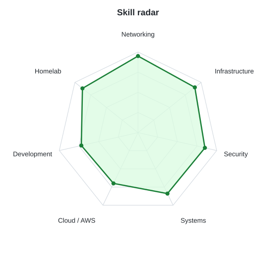
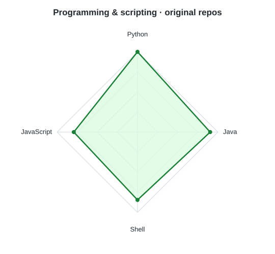
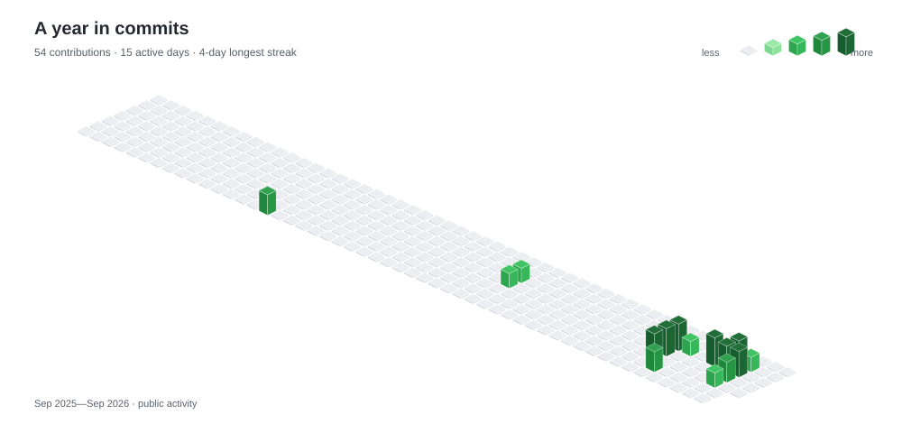
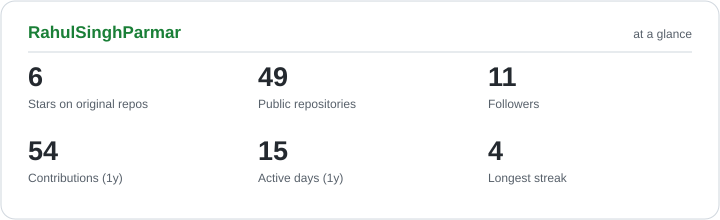
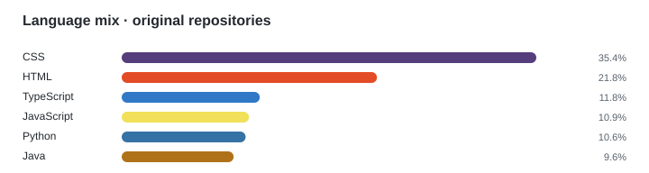
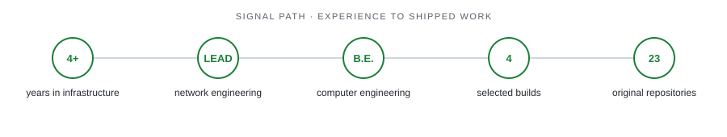
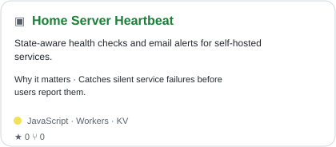
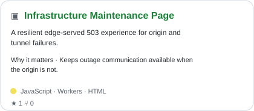
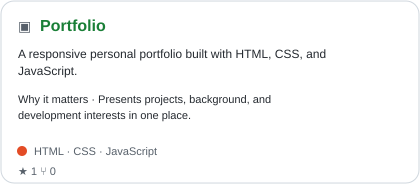
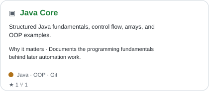

<div align="center">

<picture>
  <source media="(prefers-color-scheme: dark)" srcset="./assets/portrait-dark.svg">
  <source media="(prefers-color-scheme: light)" srcset="./assets/portrait-light.svg">
  
</picture>

<br>

### Team Lead Network Engineer · Infrastructure Operations · Network Security

<sub><strong>4+ Years · AWS &amp; Data Center · Systems Administration · Weekend Developer</strong></sub>

<br>

<a href="https://github.com/RahulSinghParmar">
  
</a>

<br>

<a href="https://www.linkedin.com/in/rahulsinghparmar4/"></a>
<a href="https://github.com/RahulSinghParmar"></a>
<a href="https://github.com/RahulSinghParmar/Portfolio"></a>


</div>

---

## `~/` whoami

```console
$ cat about.txt
```

Hi, I’m **Rahul Singh Parmar**—a **Team Lead Network Engineer** in Mumbai who builds, secures, and operates the systems behind reliable services. During the week I work across networks, infrastructure, security, Windows/Linux administration, monitoring, and data center operations. On weekends I turn operational problems into small developer tools.

- Building **[Home Server Heartbeat](https://github.com/RahulSinghParmar/home-server-heartbeat)** and **[Infrastructure Maintenance Page](https://github.com/RahulSinghParmar/maintenance-page)**
- Daily work: **Cisco · Brocade · Sophos · Windows Server · Linux · PRTG · Domotz**
- Current path: **AWS networking · PowerShell/Python automation · security engineering**
- Homelab: **Docker · Nextcloud · Jellyfin · Mattermost · self-hosting**
- Fun fact: **I enjoy debugging the entire path—from a packet on the wire to the code serving the response.**

<br>

<div align="center">
<picture>
  <source media="(prefers-color-scheme: dark)" srcset="assets/infrastructure-banner-dark.svg">
  <source media="(prefers-color-scheme: light)" srcset="assets/infrastructure-banner-light.svg">
  
</picture>
</div>

---

<div align="center">

## `~/` toolbox


<br>

<sub><strong>daily drivers</strong> · Cisco · Sophos · Windows Server · Active Directory · Linux · PowerShell · PRTG · Docker · GitHub</sub>

<br><br>

<details>
<summary><strong>open the full infrastructure + development stack</strong></summary>

<br>

**Networking:** Cisco · Brocade · VLAN · DHCP · DNS · VPN · routing · switching<br>
**Security:** Sophos Firewall · Sophos Endpoint · OpenVAS · Nessus · vulnerability assessment<br>
**Systems:** Windows Server · Active Directory · Linux · virtualization · data center operations<br>
**Cloud:** AWS · EC2 · IAM · VPC · cloud networking<br>
**Automation &amp; development:** PowerShell · Python · Java · JavaScript · SQL · Git · GitHub · Docker

</details>

</div>

---

<div align="center">

## `~/` skill radar

<picture>
  <source media="(prefers-color-scheme: dark)" srcset="assets/radar-skills-dark.svg">
  <source media="(prefers-color-scheme: light)" srcset="assets/radar-skills-light.svg">
  
</picture>
<picture>
  <source media="(prefers-color-scheme: dark)" srcset="assets/radar-languages-dark.svg">
  <source media="(prefers-color-scheme: light)" srcset="assets/radar-languages-light.svg">
  
</picture>

<br>
<sub>Left: editable focus map · Right: live programming and scripting bytes from original, non-archived repositories</sub>

</div>

---

## `~/` homelab

```text
Internet
   └── Firewall / VPN
         └── Segmented LAN
               ├── Linux + Docker
               │     ├── Nextcloud
               │     ├── Jellyfin
               │     └── Mattermost
               └── monitoring → alerts → maintenance → recovery
```

The lab is where I practice infrastructure ownership end to end: networking, access control, storage, observability, patching, backups, failure handling, and documentation someone else can follow.

---

<div align="center">

## `~/` contribution calendar

<picture>
  <source media="(prefers-color-scheme: dark)" srcset="assets/metrics.isocalendar.svg">
  <source media="(prefers-color-scheme: light)" srcset="assets/metrics.isocalendar-light.svg">
  
</picture>

<br><br>

<picture>
  <source media="(prefers-color-scheme: dark)" srcset="https://raw.githubusercontent.com/RahulSinghParmar/RahulSinghParmar/output/github-contribution-grid-snake-dark.svg">
  <source media="(prefers-color-scheme: light)" srcset="https://raw.githubusercontent.com/RahulSinghParmar/RahulSinghParmar/output/github-contribution-grid-snake.svg">
  
</picture>

</div>

---

<div align="center">

## `~/` the numbers

<picture>
  <source media="(prefers-color-scheme: dark)" srcset="assets/card-stats-dark.svg">
  <source media="(prefers-color-scheme: light)" srcset="assets/card-stats-light.svg">
  
</picture>

<br>

<picture>
  <source media="(prefers-color-scheme: dark)" srcset="assets/languages-dark.svg">
  <source media="(prefers-color-scheme: light)" srcset="assets/languages-light.svg">
  
</picture>

<br>

<picture>
  <source media="(prefers-color-scheme: dark)" srcset="assets/achievements-dark.svg">
  <source media="(prefers-color-scheme: light)" srcset="assets/achievements-light.svg">
  
</picture>

<br>
<sub>Generated locally from public GitHub data—no shared public stats service in the critical path.</sub>

</div>

---

<div align="center">

## `~/` selected work

<table>
<tr>
<td width="50%">
<a href="https://github.com/RahulSinghParmar/home-server-heartbeat">
<picture>
  <source media="(prefers-color-scheme: dark)" srcset="assets/project-home-server-heartbeat-dark.svg">
  <source media="(prefers-color-scheme: light)" srcset="assets/project-home-server-heartbeat-light.svg">
  
</picture>
</a>
</td>
<td width="50%">
<a href="https://github.com/RahulSinghParmar/maintenance-page">
<picture>
  <source media="(prefers-color-scheme: dark)" srcset="assets/project-maintenance-page-dark.svg">
  <source media="(prefers-color-scheme: light)" srcset="assets/project-maintenance-page-light.svg">
  
</picture>
</a>
</td>
</tr>
<tr>
<td width="50%">
<a href="https://github.com/RahulSinghParmar/Portfolio">
<picture>
  <source media="(prefers-color-scheme: dark)" srcset="assets/project-portfolio-dark.svg">
  <source media="(prefers-color-scheme: light)" srcset="assets/project-portfolio-light.svg">
  
</picture>
</a>
</td>
<td width="50%">
<a href="https://github.com/RahulSinghParmar/JAVA-Core">
<picture>
  <source media="(prefers-color-scheme: dark)" srcset="assets/project-java-core-dark.svg">
  <source media="(prefers-color-scheme: light)" srcset="assets/project-java-core-light.svg">
  
</picture>
</a>
</td>
</tr>
</table>

<br>
<sub>Cards are regenerated from GitHub metadata; stars, forks, and primary language stay current.</sub>

</div>

---

<div align="center">

## `~/` now playing

<a href="https://spotify-github-profile.kittinanx.com/api/view?uid=opjw6gyfksmzlxds9tsvib5sa&amp;redirect=true">
<picture>
  <source media="(prefers-color-scheme: dark)" srcset="https://spotify-github-profile.kittinanx.com/api/view?uid=opjw6gyfksmzlxds9tsvib5sa&amp;cover_image=true&amp;theme=default&amp;show_offline=true&amp;background_color=0d1117&amp;bar_color=39d353">
  <source media="(prefers-color-scheme: light)" srcset="https://spotify-github-profile.kittinanx.com/api/view?uid=opjw6gyfksmzlxds9tsvib5sa&amp;cover_image=true&amp;theme=default&amp;show_offline=true&amp;background_color=ffffff&amp;bar_color=1a7f37">
  
</picture>
</a>

<sub>Live Spotify activity · current track while listening, offline state when playback stops</sub>

</div>

---

## `~/` next hop

I’m growing toward infrastructure and cloud roles where I can combine **network engineering, systems, security, AWS, automation, and technical leadership**. I am especially interested in teams that value engineers who can operate a service, understand its failure modes, and build the tooling that makes it more reliable.

- Learning path: **VPC · EC2 · IAM · cloud networking · infrastructure security**
- Public proof: **[Microsoft Learn achievements](https://learn.microsoft.com/en-us/users/rahulsinghparmar-4681/)**
- Credentials policy: verified certifications are added only with an issuer-hosted credential link

---

<div align="center">

## `~/` connect

<a href="https://www.linkedin.com/in/rahulsinghparmar4/">LinkedIn</a> ·
<a href="https://github.com/RahulSinghParmar">GitHub</a> ·
<a href="https://github.com/RahulSinghParmar/Portfolio">Portfolio</a> ·
<a href="https://learn.microsoft.com/en-us/users/rahulsinghparmar-4681/">Microsoft Learn</a>

<br><br>

<picture>
  <source media="(prefers-color-scheme: dark)" srcset="assets/automation-loop-dark.svg">
  <source media="(prefers-color-scheme: light)" srcset="assets/automation-loop-light.svg">
  
</picture>

<details>
<summary><strong>decode the signal</strong></summary>

<br>

`01100001 01110101 01110100 01101111 01101101 01100001 01110100 01100101` → **automate**

Each eight-bit binary group is an ASCII character. It turns an ordinary footer into a small developer interaction while reinforcing the profile’s automation theme.

</details>

<br>
<sub>Open to conversations about networks, infrastructure, cloud, security, homelabs, and useful weekend builds.</sub>

</div>
