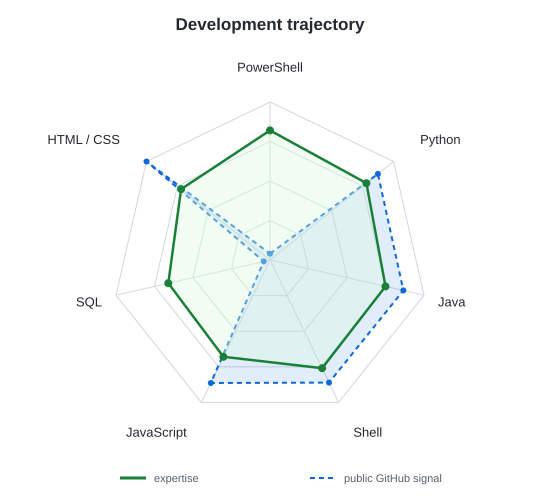
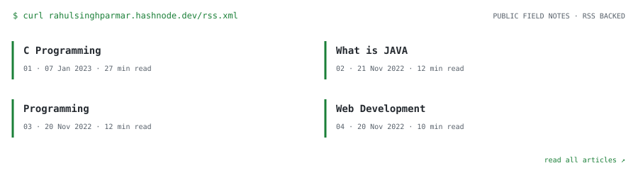

<div align="center">

<picture>
  <source media="(prefers-color-scheme: dark)" srcset="./assets/portrait-dark.svg">
  <source media="(prefers-color-scheme: light)" srcset="./assets/portrait-light.svg">
  
</picture>

<br>

### Team Lead Network Engineer · Infrastructure Operations · Network Security

<sub><strong>4+ Years · AWS &amp; Data Center · Systems Administration · Weekend Developer</strong></sub>

<br>

<a href="https://github.com/RahulSinghParmar">
  
</a>

<br>

<a href="https://www.linkedin.com/in/rahulsinghparmar4/"></a>
<a href="https://rahulsinghparmar.site"></a>
<a href="https://rahulsinghparmar.hashnode.dev/"></a>
<a href="https://twitter.com/rahulsingh474"></a>
<a href="https://github.com/RahulSinghParmar"></a>


</div>

---

## `~/` whoami

```console
$ cat about.txt
```

Hi, I’m **Rahul Singh Parmar**—a **Team Lead Network Engineer** in Mumbai who builds, secures, and operates the systems behind reliable services. During the week I work across networks, infrastructure, security, Windows/Linux administration, monitoring, and data center operations. On weekends I turn operational problems into small developer tools.

- Building **[Home Server Heartbeat](https://github.com/RahulSinghParmar/home-server-heartbeat)** and **[Infrastructure Maintenance Page](https://github.com/RahulSinghParmar/maintenance-page)**
- Daily work: **Cisco · Brocade · Sophos · Windows Server · Linux · PRTG · Domotz**
- Current path: **AWS networking · PowerShell/Python automation · security engineering**
- Homelab: **Docker · Nextcloud · Jellyfin · Mattermost · self-hosting**
- Field notes: **[networking, security, hardware, and programming](https://rahulsinghparmar.hashnode.dev/)**
- Fun fact: **I enjoy debugging the entire path—from a packet on the wire to the code serving the response.**

<br>

<div align="center">
<picture>
  <source media="(prefers-color-scheme: dark)" srcset="assets/infrastructure-banner-dark.svg">
  <source media="(prefers-color-scheme: light)" srcset="assets/infrastructure-banner-light.svg">
  
</picture>
</div>

---

<div align="center">

## `~/` toolbox


<br>

<sub><strong>daily drivers</strong> · Cisco · Sophos · Windows Server · Active Directory · Linux · PowerShell · PRTG · Docker · GitHub</sub>

<br><br>

<details>
<summary><strong>open the full infrastructure + development stack</strong></summary>

<br>

**Networking:** Cisco · Brocade · VLAN · DHCP · DNS · VPN · routing · switching<br>
**Security:** Sophos Firewall · Sophos Endpoint · OpenVAS · Nessus · vulnerability assessment<br>
**Systems:** Windows Server · Active Directory · Linux · virtualization · data center operations<br>
**Cloud:** AWS · EC2 · IAM · VPC · cloud networking<br>
**Automation &amp; development:** PowerShell · Python · Java · JavaScript · SQL · Git · GitHub · Docker

</details>

</div>

---

<div align="center">

## `~/` skill radar

<picture>
  <source media="(prefers-color-scheme: dark)" srcset="assets/radar-skills-dark.svg">
  <source media="(prefers-color-scheme: light)" srcset="assets/radar-skills-light.svg">
  
</picture>
<picture>
  <source media="(prefers-color-scheme: dark)" srcset="assets/radar-development-dark.svg">
  <source media="(prefers-color-scheme: light)" srcset="assets/radar-development-light.svg">
  
</picture>

<br>
<sub>Left: infrastructure focus · Right: self-assessed development expertise overlaid with live public GitHub evidence</sub>

</div>

---

## `~/` homelab

<div align="center">
<a href="https://dash.parmar.homes">
<picture>
  <source media="(prefers-color-scheme: dark)" srcset="assets/homelab-map-dark.svg">
  <source media="(prefers-color-scheme: light)" srcset="assets/homelab-map-light.svg">
  
</picture>
</a>
</div>

The lab is where I practice infrastructure ownership end to end: networking, access control, storage, observability, patching, backups, failure handling, and documentation someone else can follow. The public surface runs on **Glance** and presents selected operational context; addresses, credentials, and control actions are deliberately kept out of this README.

**[Open the public homelab dashboard →](https://dash.parmar.homes)**

---

## `~/` packet route challenge

<details>
<summary><strong>Start the incident simulation</strong> · approximately 60 seconds</summary>

<br>

```text
INC-047 · Public users report a timeout.
Monitoring says the Docker host and application are healthy.
DNS was changed shortly before the alert.
```

Choose your first move:

<details>
<summary><code>A</code> · Restart every container</summary>

**Not yet.** The application is healthy, and a restart destroys useful evidence without testing the failed path.

</details>

<details>
<summary><code>B</code> · Expose the application port directly</summary>

**Unsafe.** This bypasses segmentation and TLS while leaving the original edge-path failure unexplained.

</details>

<details>
<summary><code>C</code> · Trace DNS → TLS → reverse proxy → container</summary>

**Correct.** Compare the public DNS answer with the intended edge address, then test the TLS virtual host and reverse-proxy upstream independently.

<details>
<summary>Reveal the root cause</summary>

The DNS record still points to the retired edge address. Restore the intended record, verify propagation, confirm the certificate and host header, then document the rollback.

`flag{trace_the_whole_path}`

</details>

</details>

<br>
<sub>This game uses native GitHub disclosure controls—no JavaScript, tracking, or external runtime.</sub>

</details>

---

<div align="center">

## `~/` contribution calendar

<picture>
  <source media="(prefers-color-scheme: dark)" srcset="assets/metrics.isocalendar.svg">
  <source media="(prefers-color-scheme: light)" srcset="assets/metrics.isocalendar-light.svg">
  
</picture>

<br><br>

<picture>
  <source media="(prefers-color-scheme: dark)" srcset="https://raw.githubusercontent.com/RahulSinghParmar/RahulSinghParmar/output/github-contribution-grid-snake-dark.svg">
  <source media="(prefers-color-scheme: light)" srcset="https://raw.githubusercontent.com/RahulSinghParmar/RahulSinghParmar/output/github-contribution-grid-snake.svg">
  
</picture>

</div>

---

<div align="center">

## `~/` the numbers

<picture>
  <source media="(prefers-color-scheme: dark)" srcset="assets/card-stats-dark.svg">
  <source media="(prefers-color-scheme: light)" srcset="assets/card-stats-light.svg">
  
</picture>

<br>

<picture>
  <source media="(prefers-color-scheme: dark)" srcset="assets/languages-dark.svg">
  <source media="(prefers-color-scheme: light)" srcset="assets/languages-light.svg">
  
</picture>

<br>

<picture>
  <source media="(prefers-color-scheme: dark)" srcset="assets/achievements-dark.svg">
  <source media="(prefers-color-scheme: light)" srcset="assets/achievements-light.svg">
  
</picture>

<br>
<sub>Generated locally from public GitHub data—no shared public stats service in the critical path.</sub>

</div>

---

<div align="center">

## `~/` selected work

<table>
<tr>
<td width="50%">
<a href="https://github.com/RahulSinghParmar/home-server-heartbeat">
<picture>
  <source media="(prefers-color-scheme: dark)" srcset="assets/project-home-server-heartbeat-dark.svg">
  <source media="(prefers-color-scheme: light)" srcset="assets/project-home-server-heartbeat-light.svg">
  
</picture>
</a>
</td>
<td width="50%">
<a href="https://github.com/RahulSinghParmar/maintenance-page">
<picture>
  <source media="(prefers-color-scheme: dark)" srcset="assets/project-maintenance-page-dark.svg">
  <source media="(prefers-color-scheme: light)" srcset="assets/project-maintenance-page-light.svg">
  
</picture>
</a>
</td>
</tr>
<tr>
<td width="50%">
<a href="https://github.com/RahulSinghParmar/Portfolio">
<picture>
  <source media="(prefers-color-scheme: dark)" srcset="assets/project-portfolio-dark.svg">
  <source media="(prefers-color-scheme: light)" srcset="assets/project-portfolio-light.svg">
  
</picture>
</a>
</td>
<td width="50%">
<a href="https://github.com/RahulSinghParmar/JAVA-Core">
<picture>
  <source media="(prefers-color-scheme: dark)" srcset="assets/project-java-core-dark.svg">
  <source media="(prefers-color-scheme: light)" srcset="assets/project-java-core-light.svg">
  
</picture>
</a>
</td>
</tr>
</table>

<br>
<sub>Cards are regenerated from GitHub metadata; stars, forks, and primary language stay current.</sub>

</div>

---

<div align="center">

## `~/` field notes

<a href="https://rahulsinghparmar.hashnode.dev/">
<picture>
  <source media="(prefers-color-scheme: dark)" srcset="assets/blog-latest-dark.svg">
  <source media="(prefers-color-scheme: light)" srcset="assets/blog-latest-light.svg">
  
</picture>
</a>

<br>

[C Programming](https://rahulsinghparmar.hashnode.dev/c-programming) ·
[What is JAVA](https://rahulsinghparmar.hashnode.dev/what-is-java) ·
[Programming](https://rahulsinghparmar.hashnode.dev/programming) ·
[Web Development](https://rahulsinghparmar.hashnode.dev/web-development)

<br><br>

<details>
<summary><strong>browse all 8 published notes</strong></summary>

<br>

[Hardware](https://rahulsinghparmar.hashnode.dev/hardware) ·
[Internet](https://rahulsinghparmar.hashnode.dev/internet) ·
[Multimedia](https://rahulsinghparmar.hashnode.dev/multimedia) ·
[Security](https://rahulsinghparmar.hashnode.dev/security)<br>
[Web Development](https://rahulsinghparmar.hashnode.dev/web-development) ·
[Programming](https://rahulsinghparmar.hashnode.dev/programming) ·
[What is JAVA](https://rahulsinghparmar.hashnode.dev/what-is-java) ·
[C Programming](https://rahulsinghparmar.hashnode.dev/c-programming)

</details>

<br>
<sub>RSS-backed and refreshed every 12 hours · cached repository asset remains visible if Hashnode is unavailable</sub>

</div>

---

<div align="center">

## `~/` now playing

<a href="https://spotify-github-profile.kittinanx.com/api/view?uid=opjw6gyfksmzlxds9tsvib5sa&amp;redirect=true">
<picture>
  <source media="(prefers-color-scheme: dark)" srcset="https://spotify-github-profile.kittinanx.com/api/view?uid=opjw6gyfksmzlxds9tsvib5sa&amp;cover_image=true&amp;theme=default&amp;show_offline=true&amp;background_color=0d1117&amp;bar_color=39d353">
  <source media="(prefers-color-scheme: light)" srcset="https://spotify-github-profile.kittinanx.com/api/view?uid=opjw6gyfksmzlxds9tsvib5sa&amp;cover_image=true&amp;theme=default&amp;show_offline=true&amp;background_color=ffffff&amp;bar_color=1a7f37">
  
</picture>
</a>

<sub>Live Spotify activity · current track while listening, offline state when playback stops</sub>

</div>

---

## `~/` next hop

I’m growing toward infrastructure and cloud roles where I can combine **network engineering, systems, security, AWS, automation, and technical leadership**. I am especially interested in teams that value engineers who can operate a service, understand its failure modes, and build the tooling that makes it more reliable.

- Learning path: **VPC · EC2 · IAM · cloud networking · infrastructure security**
- Public proof: **[Microsoft Learn achievements](https://learn.microsoft.com/en-us/users/rahulsinghparmar-4681/)**
- Credentials policy: verified certifications are added only with an issuer-hosted credential link

---

<div align="center">

## `~/` connect

<a href="https://www.linkedin.com/in/rahulsinghparmar4/">LinkedIn</a> ·
<a href="https://github.com/RahulSinghParmar">GitHub</a> ·
<a href="https://rahulsinghparmar.site">Portfolio</a> ·
<a href="https://rahulsinghparmar.hashnode.dev/">Hashnode</a> ·
<a href="https://twitter.com/rahulsingh474">X / Twitter</a> ·
<a href="https://learn.microsoft.com/en-us/users/rahulsinghparmar-4681/">Microsoft Learn</a>

<br><br>

<picture>
  <source media="(prefers-color-scheme: dark)" srcset="assets/automation-loop-dark.svg">
  <source media="(prefers-color-scheme: light)" srcset="assets/automation-loop-light.svg">
  
</picture>

<details>
<summary><strong>decode the signal</strong></summary>

<br>

`01100001 01110101 01110100 01101111 01101101 01100001 01110100 01100101` → **automate**

Each eight-bit binary group is an ASCII character. It turns an ordinary footer into a small developer interaction while reinforcing the profile’s automation theme.

</details>

<br>
<sub>Open to conversations about networks, infrastructure, cloud, security, homelabs, technical writing, and useful weekend builds.</sub>

</div>
